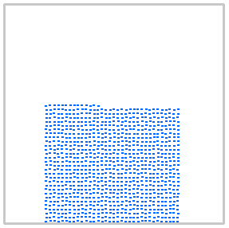
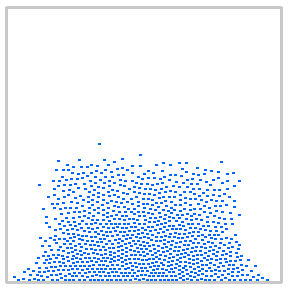
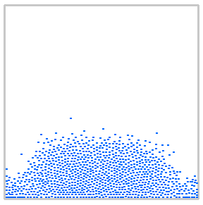
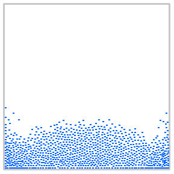
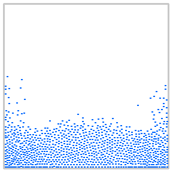
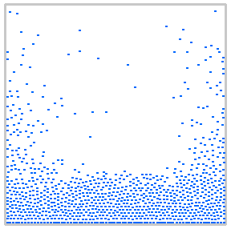

# Newtonian-Fluid-Simumation-Using-SPH

Project to simulate the behavior of Newtonian fluids (dam break experiment).

This project was my high school graduation thesis, the paper in Serbian can be found [here](https://www.mg.edu.rs/uploads/files/dokumenta/najbolji-maturski/daniil-grbic.pdf).

